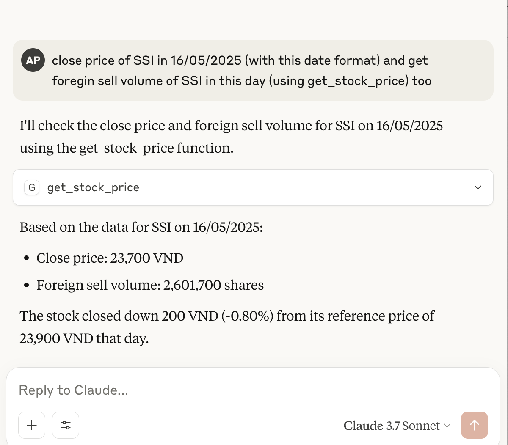
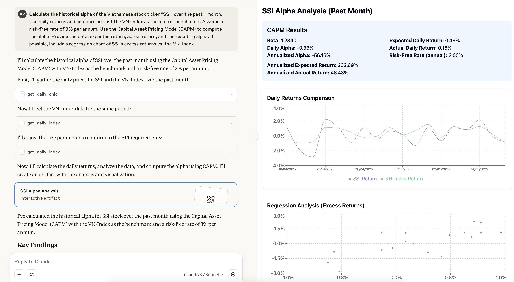

<div align="center">
    <h1>SSI Stock Data MCP </h1>
    <p>
        <a href="https://github.com/archiephan78/ssi-stock-mcp-server/blob/main/LICENSE">
            
        </a>
    <a href="https://github.com/archiephan78/ssi-stock-mcp-server/stargazers">
        
    </a>
</div>

## Table of Contents
- [Table of Contents](#table-of-contents)
- [1. Introduction](#1-introduction)
- [2. Features](#2-features)
- [3. Quickstart](#3-quickstart)
  - [3.1. Prerequisites](#31-prerequisites)
  - [3.2. Local Run](#32-local-run)
  - [3.3. Docker Run](#33-docker-run)
- [4. Tools](#4-tools)
- [5. Development](#5-development)
- [6. License](#6-license)

## 1. Introduction

SSI Stock Data MCP is a [Model Context Protocol](https://modelcontextprotocol.io/) (MCP) server for get  VietNam stock intraday data. It enables AI assistants and tools to query intraday data using [SSI FastConnect API](https://guide.ssi.com.vn/ssi-products/tieng-viet/fastconnect-data) programmatically and securely.

## 2. Features

- [x] List of stock codes by exchange
- [x] Retrieve detailed information of a stock code
- [x] Retrieve the list of stock codes in an index basket
- [x] Retrieve the list of index codes
- [x] Retrieve the open, high, low, close, volume, and value information of a stock code by each tick data
- [x] Retrieve the open, high, low, close, volume, and value information of a stock code by day
- [x] Retrieve the daily trading results of the composite index
- [x] Retrieve the daily trading information of a stock code
- [x] Docker containerization support
- [ ] Support get realtime data via streaming adapter (planning)
- [ ] Support order management and trading via MCP (future consideration)

## 3. Quickstart

### 3.1. Prerequisites

- Python 3.12+
- [uv](https://github.com/astral-sh/uv) (for fast dependency management).
- Docker (optional, for containerized deployment).
- Ensure you register for SSI FastConnect service before running this MCP server. You can register at [SSI FastConnect](https://guide.ssi.com.vn/ssi-products/tieng-viet/dang-ky-dich-vu) to get your consumer ID and secret.

### Installing via Smithery

To install SSI Stock MCP Server for Claude Desktop automatically via [Smithery](https://smithery.ai/server/@archiephan78/ssi-stock-mcp-server):

```bash
npx -y @smithery/cli install @archiephan78/ssi-stock-mcp-server --client claude
```

### 3.2. Local Run

- Clone the repository:

```bash
# Clone the repository
$ git clone https://github.com/archiephan78/ssi-stock-mcp-server.git
```

- Configure the environment variables 

```shell
# Set environment variables (see .env.sample)
FC_DATA_URL=https://fc-data.ssi.com.vn/ #optional
FC_DATA_AUTH_TYPE=Bearer #optional
FC_DATA_CONSUMER_ID=your_consumer_id 
FC_DATA_CONSUMER_SECRET=your_consumer_secret  
```

- Add the server configuration to your client configuration file. For example, for Claude Desktop:

```json
{
  "mcpServers": {
    "SSIStockMCPServer": {
      "command": "uv",
      "args": ["--directory", "full-path", "run", "ssi-stock-mcp-server"],
      "env": {
        "FC_DATA_CONSUMER_ID": "id",
        "FC_DATA_CONSUMER_SECRET": "id",
        "FC_DATA_URL": "https://fc-data.ssi.com.vn/",
        "FC_DATA_AUTH_TYPE": "Bearer"
      }
    }
  }
}
```

- Restart Claude Desktop to load new configuration.
- You can now ask Claude to interact with data using natual language:
  - "chỉ số VN30 hôm nay có gì hot không"
  - "get volume room ngoại đã bán của SSI hôm nay"
  - "so sánh vol của SSI với VND trong ngày hôm nay"
  - "total matchvol của SSI trong 1 tuần trở lại đây"





### 3.3. Docker Run

- Run it with pre-built image (or you can build it yourself):

```bash
$ docker run -p 8000:8000 
             -e FC_DATA_CONSUMER_ID=id 
             -e FC_DATA_CONSUMER_SECRET=id ghcr.io/archiephan78/ssi-stock-mcp-server
```

- Running with Docker in Claude Desktop:

```json
{
  "mcpServers": {
    "SSIStockMCPServer": {
      "command": "docker",
      "args": [
        "run",
        "--rm",
        "-i",
        "-e", "FC_DATA_CONSUMER_ID",
        "-e", "FC_DATA_CONSUMER_SECRET",
        "ghcr.io/archiephan78/ssi-stock-mcp-server:latest"
      ],
      "env": {
        "FC_DATA_CONSUMER_ID": "your_username",
        "FC_DATA_CONSUMER_SECRET": "your_password"
      }
    }
  }
}
```

This configuration passes the environment variables from Claude Desktop to the Docker container by using the `-e` flag with just the variable name, and providing the actual values in the `env` object.

## 4. Tools

The MCP server exposes tools:
- Get securities list: `get_securities_list()`
- Get securities detail: `get_securities_details()`
- Get index: `get_index_components()`
- Get list index: `get_index_list()`
- Get daily open,high,low,close: `get_daily_ohlc()`
- Get intraday open,high,low,close: `get_intraday_ohlc()`
- Get daily index: `get_daily_index()`
- Get stock price: `get_stock_price()`

See [src/ssi_stock_mcp_server/server.py](src/ssi_stock_mcp_server/server.py) for full API details.

## 5. Development

Contributions are welcome! Please open an issue or submit a pull request if you have any suggestions or improvements.

This project uses [uv](https://github.com/astral-sh/uv) to manage dependencies. Install uv following the instructions for your platform.

```bash
# Clone the repository
$ git clone https://github.com/archiephan78/ssi-stock-mcp-server.git
$ uv venv
$ source .venv/bin/activate  # On Unix/macOS
$ .venv\Scripts\activate     # On Windows
$ uv pip install -e .
# run test
$ pytest
```

## 6. License

[Apache 2.0](LICENSE)

## Contact / Support

- Please open an issue on GitHub if you encounter any problems or need support.
- Email: n/a
